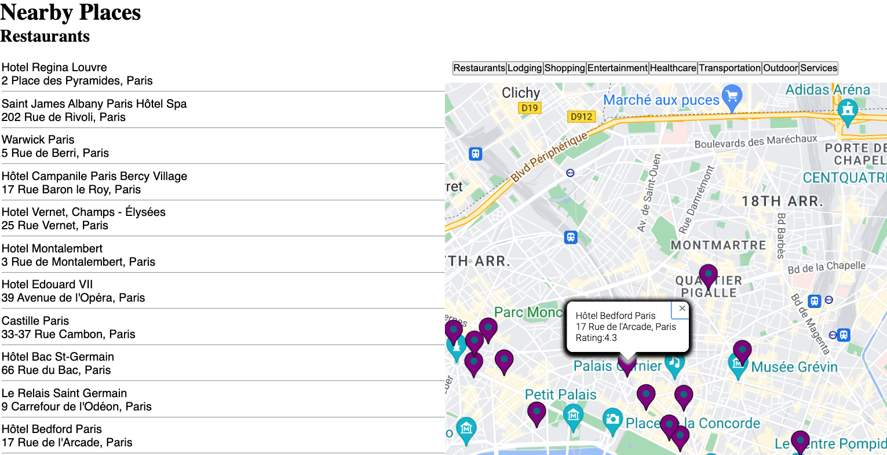

# GOOGLE MAPS

This app displays a location and searches for different types of locations. It posts markers on the locations. It also allows the user to click on the marker and retrieve information.

## Getting started

You will need to retrieve a key and a mapId from the [Google Developer Website](https://developers.google.com/maps) in order for this app to run.

Google Maps APi is challenging and takes a bit of manipulation. A combination of docs, video and intuition will most likely need to be used to get funcitonality working the way you like.

This app uses [vis.gl's react-google-map](https://github.com/visgl/react-google-maps/tree/main) package because there seems to be more and sometimes clearer documentation around implementation.

## Resources

- [Visgl React Google Maps](https://github.com/visgl/react-google-maps/tree/main)
- [Google Maps API](https://developers.google.com/maps)
- [react-map-gl docs - Get Started](https://visgl.github.io/react-map-gl/docs/get-started)
- [Google Maps Series with Lee Halliday](https://www.youtube.com/watch?v=PfZ4oLftItk&list=PL2rFahu9sLJ2QuJaKKYDaJp0YqjFCDCtN)
